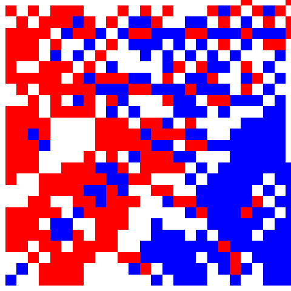

# 🌪️ Spiral Growth Simulator

An interactive Streamlit-based simulation of spiral growth, territory occupation, and competitive expansion inspired by chess-like movement rules and mathematical spiral systems.

This project explores emergent behavior from simple rules applied on an expanding spiral grid, producing complex and beautiful large-scale structures.


---

## 🌐 Inspiration

This simulation is inspired by the OEIS sequence:

👉 https://oeis.org/A392177

Which describes a two-player spiral-based system where:
- Black and Red players take turns placing knights on a spiral grid
- Each placement is constrained by attack patterns
- Complex global structures emerge from simple local rules

Related sequences:
- A392178 (Red player)
- A392179 (empty cells)
- A392180 (difference dynamics)

---

## 🎥 Related Video

The concept is closely related to ideas popularized in mathematical visualization content such as:

👉 Numberphile video:
https://www.youtube.com/watch?v=UiX4CFIiegM

This video explores spiral growth, emergent patterns, and how simple rules can generate unexpectedly complex structures.

---

## 🚀 Live Demo

If deployed on Streamlit Cloud:


spiralgrowth.streamlit.app

---

## 🎮 Features

- 🌀 Infinite spiral movement system
- ♟️ 15+ custom movement pieces (Knight, Camel, Zebra, Eland, etc.)
- 👥 Multi-player simulation (1–8 players)
- 🎨 Fully customizable colors
- 🔀 Randomized player generation system
- ⚔️ Attack-map based territory conflict system
- 🎞️ GIF export of full simulation
- 📽️ Smooth frame-by-frame playback (no lag viewer)
- 📊 Adjustable turns and FPS
- ⚡ Fully interactive Streamlit UI

---

## 🧠 How It Works

Each player starts at the origin `(0, 0)` and expands outward using a spiral-based rule system.

At every turn:

1. Players attempt to move to the next available spiral position
2. A position is only valid if:
   - It is not already occupied
   - It is not attacked by an opposing player
3. Each piece type defines a unique attack pattern
4. The system evolves into a competitive spatial partitioning process

This produces emergent patterns similar to cellular automata and OEIS-defined spiral systems.

---

## ♟️ Piece Types

The simulator includes both chess-inspired and custom movement sets:

- Knight, King, Wazir, Ferz
- Camel, Zebra, Giraffe
- Antelope, Eland
- Satrap, Aspbad, Spehbed, Marzban
- Directional Pawns (North, South, East, West)

Each piece defines a unique geometric influence pattern over the grid.

---

## 🎛️ Controls

All configuration is handled via the Streamlit sidebar:

- Number of players (1–8)
- Number of turns
- Background color
- Turn order (Cyclic / Random)
- Playback FPS
- Frame generation toggle
- Individual piece selection
- Color selection
- 🎲 Randomize Players button

---

## 📦 Export Options

### 🎞️ GIF Export
- Automatically generates a full animation of the simulation
- Final frame pauses for emphasis
- Center-cropped output for consistent framing

### 📽️ Smooth Viewer
- Browser-based frame playback system
- Slider + play/pause controls
- No Streamlit animation lag

---

## ⚙️ Installation

```bash
git clone https://github.com/YOUR_USERNAME/spiral-growth-sim.git
cd spiral-growth-sim
pip install -r requirements.txt
streamlit run app.py
```

## 🧪 Technical Details
Grid is represented using integer coordinates
Positions are encoded using bitwise hashing for efficiency
Attack map uses bitmasking per player
Spiral movement guarantees deterministic coverage of the plane
Frames are generated from full simulation snapshots
